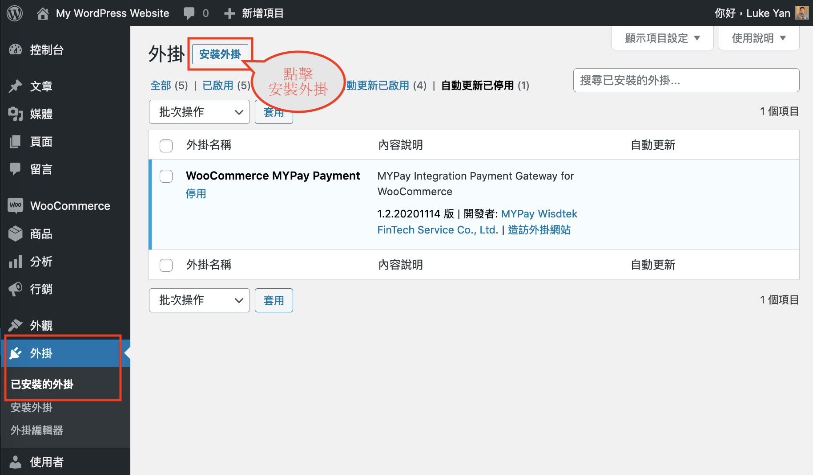
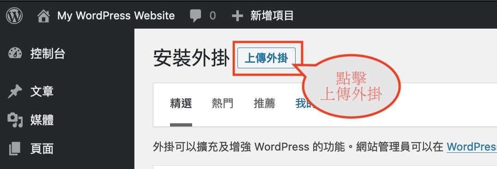
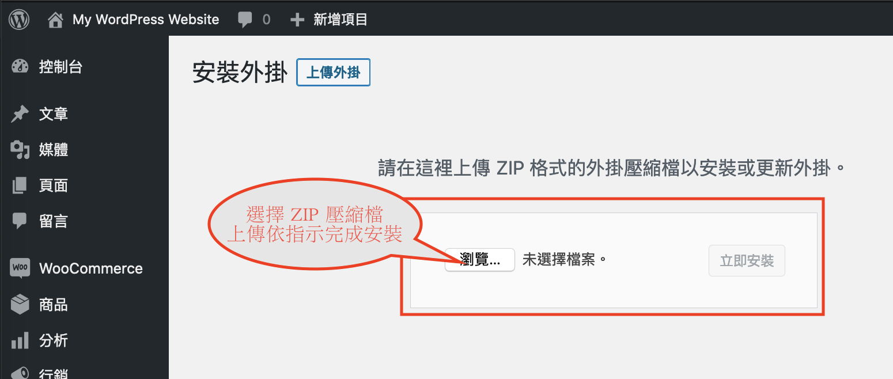
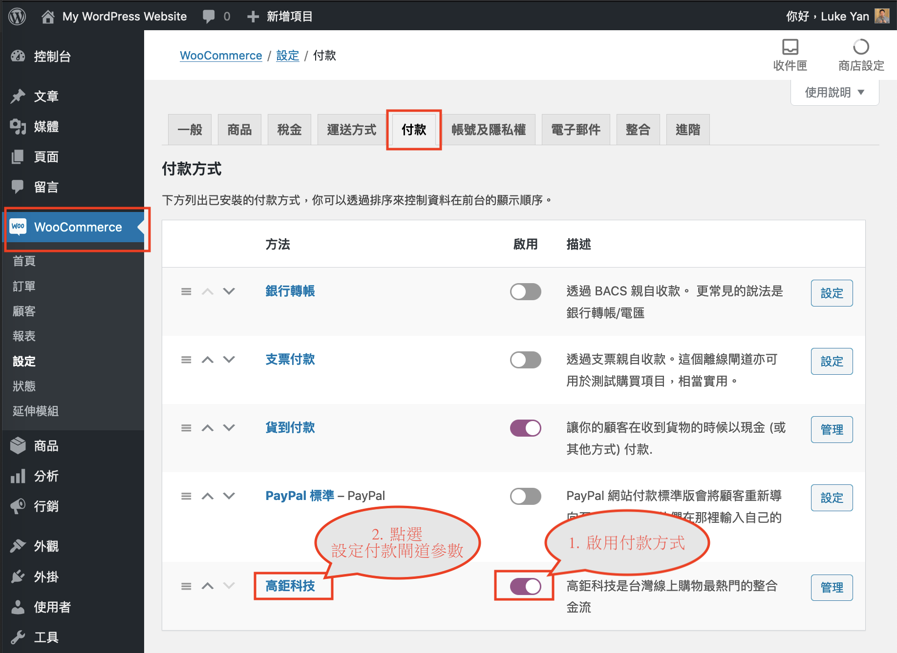
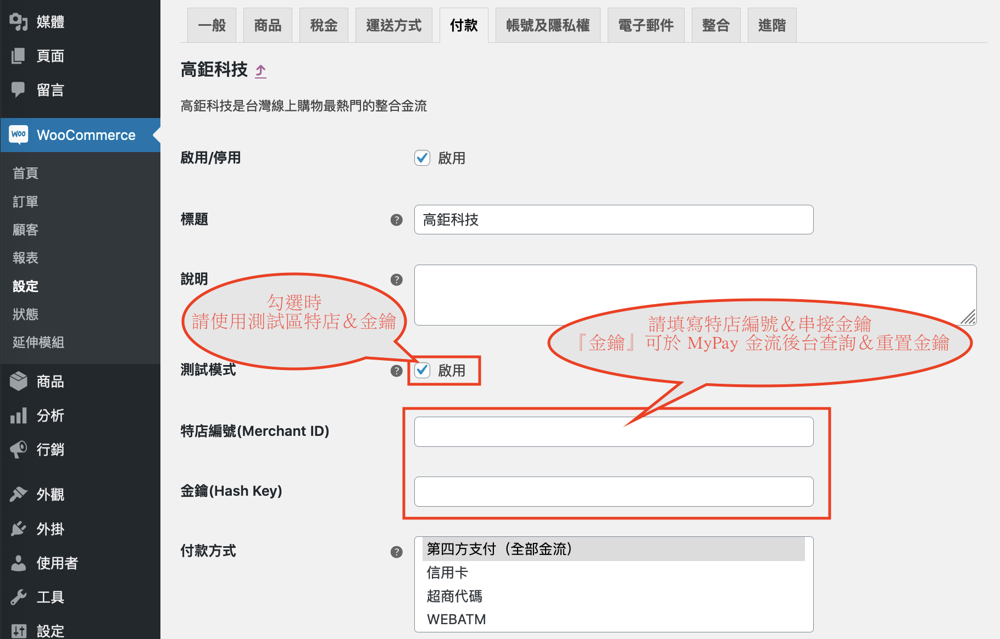
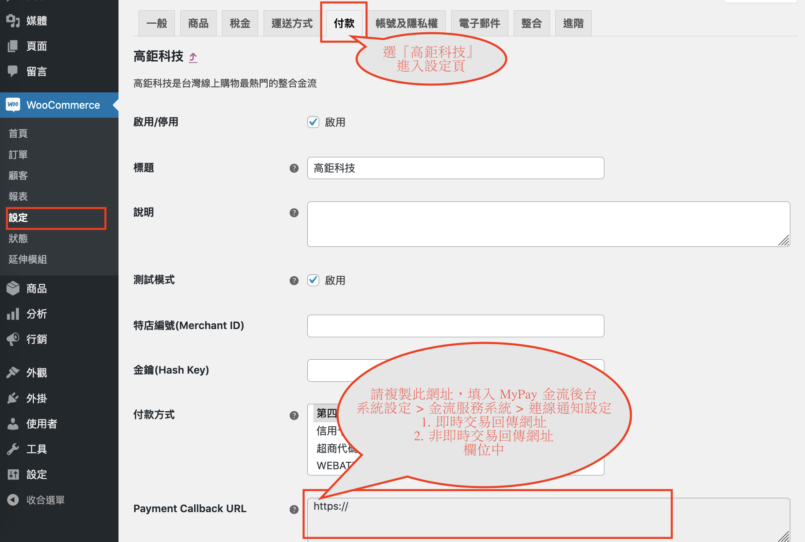
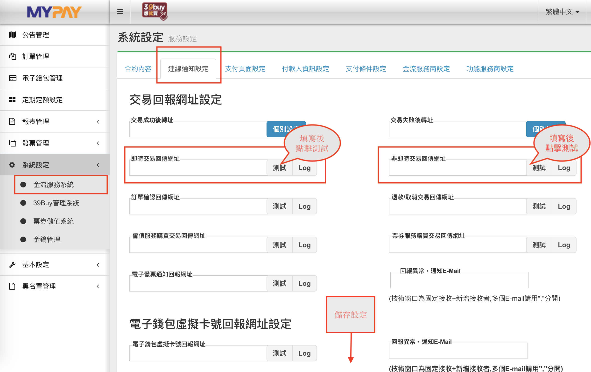
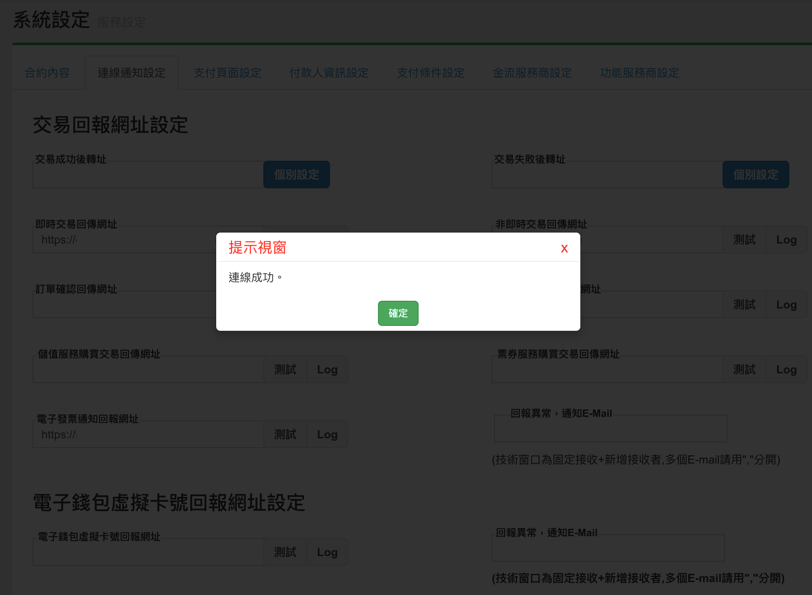

MyPay WooCommerce Payment Gateway 安裝設定
====
編輯整理：Luke

## 系統需求
* Requires at least: wordpress **5.3**, WooCommerce **3.5**
* Tested up to: wordpress 5.5.1, WooCommerce 4.6.1
* Requires PHP: **7.2** or later
* 注意事項：請先安裝 WooCommerce 3.5 以上版本，並完成 WooCommerce 初始化設定

## 安裝 Payment Gateway
* 
* 於 wordpress 後台：外掛 > 安裝外掛
* 
* 點擊『上傳外掛』
* 
* 選擇 ZIP 壓縮檔，上傳後依指示完成安裝

## 設定 Payment Gateway
* 
* WooCommerce > 設定 > 付款
* 將『高鉅科技』付款方式『啟用』，點選標題進入付款閘道參數設定
* 
* 依指示填寫『正式區或測試區』的特店編號、金鑰
* 『金鑰』可於 MyPay 金流後台查詢、重置金鑰，點擊下方『儲存』設定變更
* 
* 複製『Paymant Callback URL』欄位資料
* 
* 至 MyPay 金流後台：系統設定 > 金流服務系統 > 連線通知設定
* 填寫於『即時交易回傳網址、非即時交易回傳網址』欄位，並點擊『測試』可測試 payment callback API 是否完成連線。若測試連線成功，會顯示提示訊息如下：
* 
* 說明：若您的支付工具有啟用『非即時交易』支付方式時，請務必填寫『非即時交易回傳網址』此欄位設定，WooCommerce 才能正確接收非即時交易通知的付款完成資訊，以利後續更新訂單狀態。

